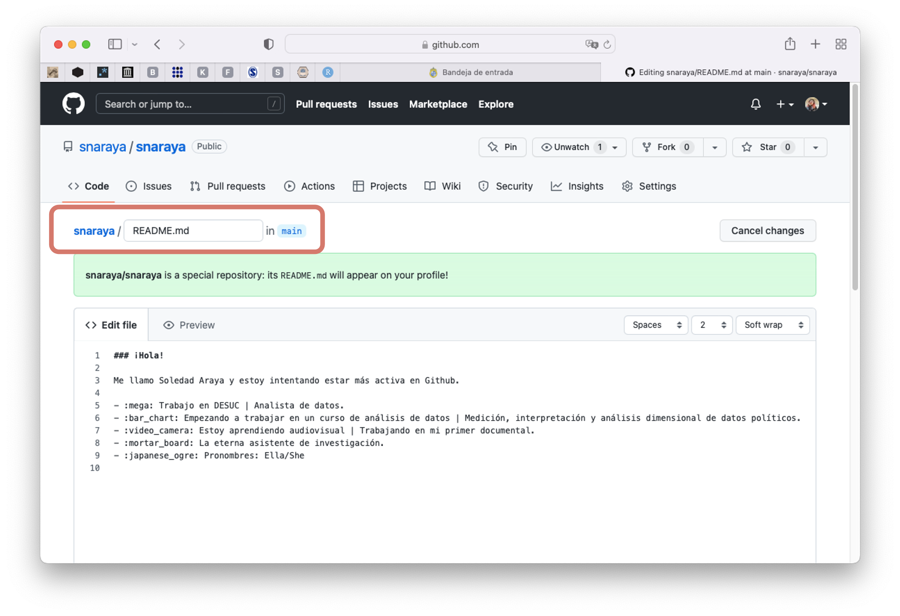
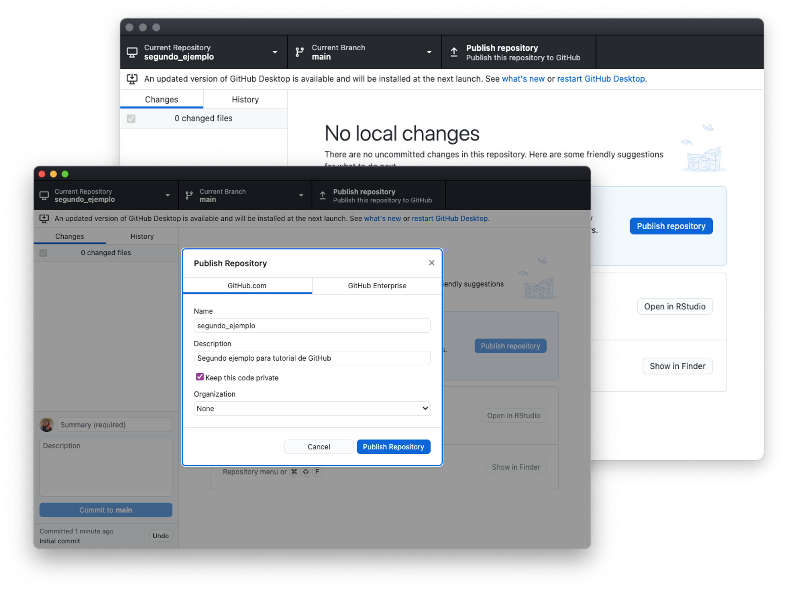

# Tutorial de GitHub
Medición y análisis dimensional de datos políticos ICP5006

***

>**¿Qué es GitHub?**
Es una plataforma de hospedaje de código para el control de versiones y la colaboración. Esto permite que podamos trabajar juntos en el mismo proyecto. GitHub se utiliza, entonces, para compartir el desarrollo de paquetes y funciones. Pero no sólo eso, también puede albergar diferentes tipos de documentos. El README.md que están leyendo es un archivo Markdown, que es diferente al estilo R Markdown.

## Primeros pasos

Ya que contamos con una cuenta, necesitamos saber algunas cosas de la interfaz de la página principal. En la primera imagen a la izquierda, tenemos los repositorios que se han usado recientemente. En el panel central, se verán las acciones de las personas a quienes sigues. Si alguien crea un nuevo repositorio o repo, lo veremos reflejado aquí, como también si sigues a alguien nuevo o haces alguna interacción.

En la esquina superior derecha, en `+` nos dejará crear nuevas repos.

Si entramos a nuestro usuario, veremos nuestra página principal. En el perfil, podemos personalizarlo con nuestra foto, intereses profesionales y otros. En este caso, lo ocupo como una carta de presentación apuntando en una lista de mis intereses, el lugar donde trabajo y, básicamente, en qué estoy actualmente.

Para hacerlo, sólo deben crear una repo con sus nombres. Entonces, si mi nombre de usuario es `snaraya`, la repo también se llamará `snaraya`. Los invito a personalizar su perfil, agregando aquellas cosas que les gustaría aprender sobre programación, temas de interés de investigación, y algunos datos personales entretenidos.

Entonces, crearemos una repo para hacer este ejercicio:

1. Nombraremos la nueva repo: `instrucciones_github`
2. En la caja de **Descripción/Description**, escribirmos una descripción corta.
3. Agregamos un archivo README.
4. Seleccionamos si la repo será **Pública** o **Privada**.

En la siguiente imagen, vemos que el README contiene el nombre de la repo. Como no agregamos descripción, no aparece nada más, en el caso de tener una descripción, esta también se verá reflejada aquí. 

Si queremos editar el archivo README lo podemos hacer directamente desde la página. Podemos ir revisando los cambios que realizamos en `Preview`. Cuando estés conforme con los cambios realizados en el README, tienes que confirmar los cambios que estás realizando. Entonces:

1. Editamos el archivo.
2. En la primera caja de **Commit changes**, agregamos información sobre los cambios que estamos realizando al documento.
3. Hacemos clic en **Commit changes** (botón verde).

>También lo podemos hacer de manera remota, pero eso lo veremos más adelante.

***

### GitHub Desktop

Para este curso, usaremos [GitHub Desktop](https://desktop.github.com), si tienes más experiencia en programación puedes ver otras formas de usar GitHub a través de la terminal del computador. Una vez instalado, ingresan con su usuario y contraseña. 

Para agregar la repo que tenemos creada en la página de GitHub, hacemos clic en `code` y nos aparecerán opciones. Podemos copiar el link, abrir directamente la repo en GitHub Desktop o podemos descargar los documentos que están en la repo. En este caso, haremos clic en la segunda opción.

GitHub Desktop se abrirá automáticamente, y nos preguntará en dónde queremos guardar esta carpera (local path o dirección)

GitHub Desktop se mostrará de la siguiente manera. Como podemos observar, estamos trabajando en el directorio de la repo recién importada (**Current Repository**).

Si hacemos cambios en la página o en la carpeta local, se verán reflejados aquí (en verde cuando se agregan cosas, en rojo cuando se eliminan). Ya en este paso, puede ir al directorio que contiene la carpeta para verificar que el contenido se encuentre ahí. Cuando uno trabaja con proyectos más grandes, es mucho más fácil trabajar de manera local que online.

Al igual que el cambio que realizamos en el README de manera online, después de realizar un cambio local debemos describir lo que hicimos en pocas palabras, y hacer un **commit** de los cambios realizados. 

Luego, es necesario que "empujemos" esos cambios a la versión online con **Push origin**.

Ahora, veremos reflejados estos cambios en la versión online de nuestra carpeta.

> Cuando hablamos de `git` es común usar "remoto" para hablar del trabajo online y usar "local" para hablar de trabajos contenidos en una carpeta local de tu computador. Aquí no se ocupan estrictamente de esa manera.

***

A continuación, veremos otra forma de hacerlo (estas dos tampoco son las únicas formas de crear contenido en GitHub, pero son las más básicas e intuitivas). Creamos una repo de manera local en nuestro computador, la cual se llama `segundo_ejemplo`. Le damos la dirección donde quedará alojada, una descripción breve y un README.

Al crearlo no se subirá automáticamente a nuestro perfil de GitHub. Como se puede observar, necesitamos poner en **Publish Repository** para que este tenga una copia de manera remota.

A continuación, se ven los dos repositorios creados para este ejemplo en las repos que tengo creada en mi cuenta.

***

### Diccionario:
Se irá actualizando a medida que vayamos avanzando en el uso de GitHub.

| Término | Definición | 
| --------- | --------- | 
| Push | Nos sirve para subir lo que tenemos de manera local al repositorio contenido en la web. | 
| Pull | Comando que nos permite obtener e integrar un repositorio con otro, o con la rama contenida de manera local. | 
| Pull request | **crear solititud de extracción**, crear la solicitud para unir/integrar con un repositorio o con la rama contenida de manera local. | 
| Merge pull request | **Fusionar solicitud de cambios** | 
| Commit | Es un cambio individual hecho a un archivo (de manera local u online). Es como cuando unno guarda información, excepto que cada vez que hacemos un **commit** se crea un ID única que nos permite llevar un recuento de los cambios que se han realizado. | 
| Branch | Versión paralela de una repo. El repositorio la contiene, pero no afecta la rama principal o primaria, lo que te permite trabajar libremente sin interrumpir la versión "activa". Una vez que se han hecho las modificaciones que deseabas, puedes fusionar tu rama de nuevo en la rama principal para publicar esas modificaciones. | 
| HEAD | Un **commit** (cambios confirmados) de una rama, a menudo el **commit** más reciente en la punta de la rama. | 
| README | Un archivo de texto que contiene información acerca de los archivos en un repositorio que, generalmente, es el primer archivo que verá un visitante de tu repositorio. Un archivo README, junto con una licencia de repositorio, las pautas de contribución y un código de conducta, te ayuda a compartir expectativas y administrar contribuciones para tu proyecto. | 
| Repository | Un repositorio es el elemento más básico de GitHub. Son más fáciles de imaginar como la carpeta de un proyecto. Un repositorio contiene todos los archivos del proyecto (incluida la documentación) y almacena el historial de revisión de cada archivo. Los repositorios pueden tener varios colaboradores y pueden ser públicos o privados. | 

***

Fuente: [GitHub Docs](https://docs.github.com/es/get-started/quickstart/hello-world)
